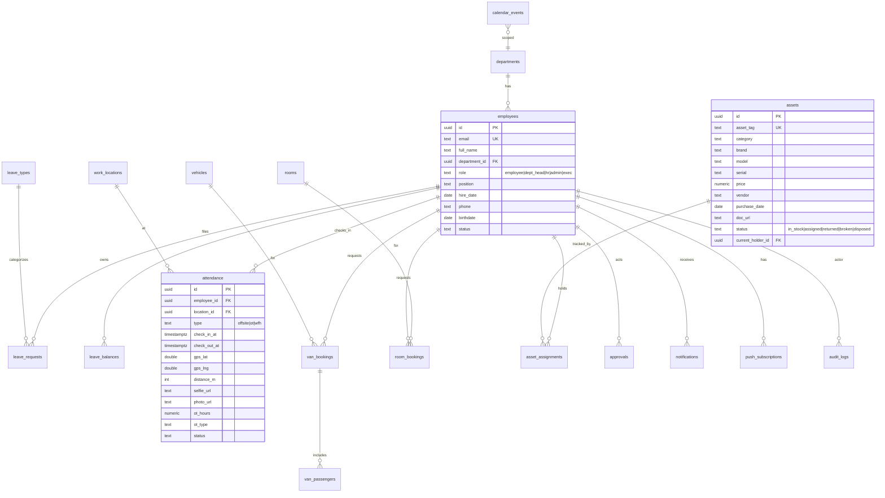

# IRDP Internal System — พิมพ์เขียวสถาปัตยกรรม (v0.1)

> มูลนิธิสถาบันวิจัยและพัฒนาองค์กรภาครัฐ (IRDP)
> เอกสารนี้คือ blueprint สำหรับส่งต่อให้ Claude Code สร้างจริง — prose เป็นไทย ส่วนชื่อ table/field/role เป็นอังกฤษเพื่อใช้ในโค้ดได้ทันที

---

## 1. ภาพรวมและเป้าหมาย

ระบบภายในองค์กรบนเว็บ (PWA, เน้นมือถือ) สำหรับพนักงาน ~30 คน ใน 4 ฝ่าย แก้ปัญหาหลัก 2 เรื่อง:
1. HR ตรวจสอบการปฏิบัติงานนอกเวลา/นอกสถานที่ได้ยาก → ใช้ GPS + เซลฟี่ + รูปหน้างาน + เวลา ที่ตรวจย้อนหลังได้
2. ระบบลายังพึ่ง Google Form/Sheet/อีเมล/LINE → ย้ายมาเป็นระบบเดียว อนุมัติสวยงาม แจ้งเตือน push ไม่จำกัดโควต้า

ออกแบบให้ **ขยายต่อได้** ไม่จบแค่นี้ (มีโครงเผื่อระบบในอนาคต)

---

## 2. Tech Stack

| ชั้น | เทคโนโลยี | เหตุผล |
|---|---|---|
| Frontend | **Next.js (App Router) + TypeScript** | คุณคุ้นอยู่แล้ว, SSR + API routes ในตัว |
| UI | **Tailwind CSS + shadcn/ui** | คุม design system ง่าย, โทน Notion/iOS ได้ |
| Backend/DB | **Supabase** (Postgres + Auth + Storage + RLS + Edge Functions) | RLS บังคับสิทธิ์ระดับฐานข้อมูล = ปลอดภัยสำหรับข้อมูลพนักงาน (PDPA) |
| Hosting/Cron | **Vercel** (Cron Jobs) | auto-deploy จาก git + cron ยิงแจ้งเตือน |
| Push | **Web Push (VAPID) + Service Worker** | ฟรี ไม่จำกัดโควต้า, ทำงานบน PWA |
| ปฏิทิน | **Google Calendar API** | ซิงค์เข้าปฏิทินองค์กร (Workspace irdp.org) |
| Auth | **Supabase Auth → Google OAuth** จำกัดโดเมน `irdp.org` | ผูกกับ Workspace, HR เตรียมโปรไฟล์ล่วงหน้า |

> **PWA / iOS:** พนักงานส่วนใหญ่ใช้ iPhone — web push บน iOS ใช้ได้เฉพาะหลัง **Add to Home Screen (iOS 16.4+)** เท่านั้น ต้องมี onboarding บังคับ/แนะนำให้ติดตั้งลงโฮมสกรีนตั้งแต่ล็อกอินครั้งแรก และทดสอบ push บน iOS เป็นพิเศษ

---

## 3. Design System (โทนสว่าง · Notion × iOS)

**สีจากโลโก้ (sampled):**

| Token | HEX | ใช้ตรงไหน |
|---|---|---|
| `--primary` | `#283897` | สีหลัก (ปุ่ม, header, ลิงก์, แถบ active) |
| `--primary-dark` | `#1F3093` | hover/active |
| `--accent` | `#F36523` | เน้น/แจ้งเตือน/ปุ่มรอง, badge |
| `--accent-dark` | `#D9551A` | hover ส้ม |
| `--silver-1 / --silver-2` | `#C8CDD6` / `#8A93A3` | gradient ตกแต่ง (จากเสี้ยวเงินในโลโก้) |
| `--bg` | `#FFFFFF` | พื้นหลังหลัก |
| `--surface` | `#F7F8FA` | การ์ด/แผง (สไตล์ Notion) |
| `--border` | `#E8EAED` | เส้นขอบบาง |
| `--text` / `--muted` | `#1A1A2E` / `#8A8F9A` | ข้อความหลัก/รอง |
| success/warning/danger | `#1F9D55` / `#E8A317` / `#E5484D` | สถานะ |

**ฟอนต์:** `IBM Plex Sans Thai` (ไม่มีหัว/loopless) สำหรับไทย + `IBM Plex Sans` สำหรับอังกฤษ, mono = `IBM Plex Mono` (โหลดฟรีจาก Google Fonts)

**หลักการ UI:**
- โทนสว่าง พื้นที่ว่างเยอะ เส้นขอบบาง การ์ดมุมโค้ง (radius 12–16px) แบบ Notion
- มือถือเป็นหลัก: **bottom tab bar** (iOS style), ปุ่มแตะใหญ่ ≥44px, ใช้ bottom sheet/modal สำหรับฟอร์ม
- โลโก้: ใช้ "ไอคอนเสี้ยว C" (`LOGO_IRDP_FULL_ENG.jpg`) เป็น **PWA icon + favicon + โลโก้บนมือถือ**; จอกว้างใช้โลโก้เต็ม (`LOGO_IRDP_TH3000.jpg`)
- รองรับ dark mode ภายหลังได้ (วาง token ไว้แล้ว) แต่ default = light

---

## 4. ผู้ใช้ บทบาท และสิทธิ์ (RBAC)

5 บทบาท (`role` enum) + สังกัด `department_id`:

| Role | ใครบ้าง | สิทธิ์โดยสรุป |
|---|---|---|
| `employee` | พนักงานทั่วไป | สร้าง/ดู/แก้ (ก่อนอนุมัติ) เฉพาะของตัวเอง; เห็นทรัพย์สิน/ปฏิทินของตัวเอง + กิจกรรมองค์กร |
| `dept_head` (ผอ.ฝ่าย ×4) | หัวหน้า 4 ฝ่าย | **อนุมัติ/ตีกลับ/ยกเลิก/แก้ไข** คำขอในฝ่ายตัวเอง; อนุมัติคำขอของตัวเองได้ (แทนผู้บริหาร); เห็นปฏิทิน+ข้อมูลทั้งฝ่าย; ออกรีพอร์ต; เห็นทรัพย์สินทั้งหมด |
| `hr` (1 คน, ในธุรการ) | ฝ่ายบุคคล | **เฝ้าดูทุกการเคลื่อนไหวทุกฝ่าย**; แก้วัน-เวลา/แก้คำขอได้; กรอก master data (โควต้า, วันเริ่มงาน, วันหยุด, กิจกรรม); ออกรีพอร์ต; **อนุมัติสำรองไม่ได้** |
| `admin` (IT = คุณ, ในธุรการ) | ผู้ดูแลระบบ | god-mode: จัดการผู้ใช้/สถานที่/ทรัพย์สิน, เห็น+แก้ทุกอย่าง, ออกรีพอร์ต |
| `exec` (×3: กจ, รองกจอาวุโส, รองกจ) | ผู้บริหาร | **ดูทุกอย่างทุกฝ่าย + กด "รับทราบ" (acknowledge)**; แก้ไขได้เมื่อจำเป็น (override) แต่ **ไม่อยู่ในสายอนุมัติประจำ** |

> หมายเหตุ: ทั้ง `hr` และ `admin` สังกัดฝ่ายธุรการ แต่มี role พิเศษ; การบังคับสิทธิ์จริงทำที่ **Postgres RLS** ไม่ใช่แค่ซ่อนปุ่มหน้าบ้าน

---

## 5. โมเดลการอนุมัติ (State Machine ร่วมทุกโมดูล)

```
draft ──submit──▶ submitted ──approve──▶ approved ──▶ (exec acknowledge)
                     │  ▲                    │
                     │  └──return───┐        ├──▶ ลา/OT: ส่งต่อ HR/การเงิน (export)
                  reject          (พนักงานแก้แล้วส่งใหม่)
                     │
                     ▼
                 rejected            ทุกสถานะก่อน approved: cancel ได้
```

**กติกาสำคัญ:**
- พนักงานยื่น → **หัวหน้าฝ่าย** อนุมัติ/ตีกลับ/ยกเลิก/แก้ไข
- **หลังอนุมัติ: พนักงานแก้ไม่ได้** (ล็อก) แต่ `dept_head` / `hr` / `admin` / `exec` ยังแก้ได้ (ทุกการแก้ลง **audit log**)
- หัวหน้าฝ่ายยื่นเอง → **อนุมัติตัวเองได้** (เพราะผู้บริหารไม่สะดวกอนุมัติ) → ระบบแจ้งผู้บริหารให้ "รับทราบ"
- คำขอที่เกี่ยวเงิน (ลา/OT) เมื่ออนุมัติแล้ว → เข้าคิว **export ให้การเงิน/HR** (ไม่คิดเงินในระบบ)
- `exec` มี timeline "รับทราบ" บันทึกว่าใคร-เมื่อไหร่ (ตอบโจทย์ "ผู้บริหารต้องรับทราบ")

---

## 6. โมดูล (v1)

### 6.1 ระบบลา (Leave)
- ประเภท: **ป่วย (sick) / กิจ (personal) / พักร้อน (vacation)**
- หน่วยเป็น **ชั่วโมง**; เต็มวัน = **7.5 ชม.** (08:30–17:00 หักพักเที่ยง 12:00–13:00), ครึ่งวัน = 3.75 ชม.
- **คำนวณโควต้าอัตโนมัติจาก `hire_date`** (HR กรอกวันเริ่มงาน) ตามระเบียบ พ.ศ. 2563 ข้อ 11/21/22:
  - ป่วย: 30 วัน/ปี (รีเซ็ตทุกปี)
  - กิจ: 10 วัน/ปี (รีเซ็ตทุกปี)
  - พักร้อน (ขั้นบันไดตามอายุงาน + **สะสมข้ามปีได้ 1 ปี**):
    - ปีแรก บรรจุก่อน ก.ค. = 7 วัน (ใช้ในปีนั้น ไม่ทบ) / บรรจุหลัง ก.ค. = 0
    - ปีปฏิทินที่ 1–3 = 10 วัน, ปีที่ 4–5 = 12 วัน, ปีที่ 5 ขึ้นไป = 15 วัน
- **⚠️ จุดกำกวมในระเบียบ:** "ปีที่ 4–5 = 12" ทับกับ "ปีที่ 5 ขึ้นไป = 15" ตรงปีที่ 5 — ต้องยืนยันการตีความ (ผมเสนอ: ปี 4–5 = 12, ปี 6 ขึ้นไป = 15) ก่อนเขียน accrual engine
- Validations (เตือน ไม่บล็อกแข็ง เพื่อความยืดหยุ่น):
  - ป่วย ≥ 3 วัน → ต้องแนบใบรับรองแพทย์; แจ้งภายใน 11:00 ของวันแรก
  - พักร้อน ≤ 3 วัน แจ้งล่วงหน้า 3 วัน, > 3 วัน แจ้งล่วงหน้า 7 วัน
- แสดง balance สด: ได้สิทธิ์ / ใช้ไป / คงเหลือ / สะสม (เฉพาะพักร้อน)

### 6.2 ปฏิบัติงานนอกสถานที่ + OT (Offsite & OT)
- **เช็คอินแบบเบา:** GPS ต้องอยู่ใน **รัศมี 200 ม.** ของสถานที่ที่ admin/HR กำหนด + **เซลฟี่ + รูปหน้างาน 1 รูป (อะไรก็ได้) + เวลา** → HR ตรวจด้วยตา (ไม่ใช้ face recognition)
- กรอกเวลาเข้า-ออกอิสระ; **OT คำนวณจากเวลาหลัง 17:00** (ตามตัวอย่างคุณ: 06:00–22:30 → OT = 17:00–22:30 = 5.5 ชม.)
- จำแนกประเภท OT ตามระเบียบ ข้อ 19: วันทำงาน ×1.5 / ทำงานวันหยุดในเวลา ×1 / วันหยุดเกินเวลา ×3
- กติกาเพิ่ม: ถ้า OT ≥ 2 ชม. หัก 20 นาที (ข้อ 5.2); เตือนถ้า OT รวม > 36 ชม./สัปดาห์ (ข้อ 12); **ระดับ ผอ.ฝ่ายขึ้นไปไม่มีสิทธิ์ OT** (ข้อ 18)
- คำนวณ "จำนวนชั่วโมง + ประเภท" → **export ให้การเงิน** (ไม่คิดเป็นเงิน)
- อนุมัติโดยหัวหน้าฝ่าย; HR/admin แก้เวลาได้

### 6.3 Work from Anywhere (WFH) — ระเบียบ 2567
- ยื่นขอ → หัวหน้าฝ่ายอนุมัติ
- **เช็คอินวันละ 2 ครั้ง (08:30 / 17:00)** + ช่องรายงานผลรายสัปดาห์
- **บล็อกการขอ OT/ค่าทำงานวันหยุด/ค่าเดินทางในวันที่ WFH อัตโนมัติ** (ข้อ 5(7))

### 6.4 จองรถตู้ (Van Booking)
- มี **รถตู้ 1 คัน**, **คนขับ 1 คน (เป็นพนักงาน, ล็อกอินได้)** เห็นปฏิทินรถ + รับแจ้งเตือนทุกครั้งที่มีจอง
- เพิ่มผู้ร่วมเดินทาง (เลือกจากรายชื่อพนักงาน) → ผู้ร่วมเดินทางได้รับแจ้งเตือนด้วย
- **เช็คชนเวลาอัตโนมัติ:** จองซ้ำไม่ได้ + บอกว่าซ้ำกับใคร; ไม่ต้องอนุมัติ; admin/HR แก้/ปรับเวลาได้ พนักงานแก้ไม่ได้

### 6.5 จองห้องประชุม (Room Booking)
- 2 ห้อง: **ห้องเคียงตะวัน (เล็ก)** / **ห้องอิงจันทร์ (ใหญ่)**
- เช็คชนอัตโนมัติ + บอกว่าซ้ำกับใคร; ไม่ต้องอนุมัติ; admin/HR แก้ได้

### 6.6 ปฏิทินองค์กร (Calendar)
- รวม: กิจกรรมองค์กร (HR/admin ใส่: วันทำบุญ/วันหยุดประจำปี/วันประชุม), วันลาที่อนุมัติแล้ว, การจองรถ/ห้อง
- การมองเห็น: `employee` เห็นของตัวเอง + กิจกรรมองค์กร; `dept_head` เห็นวันลาคนในฝ่ายตัวเอง; `exec`/`hr`/`admin` เห็นทุกฝ่าย
- **ซิงค์ Google Calendar:** push อีเวนต์ที่อนุมัติแล้ว/กิจกรรมองค์กรไปยังปฏิทินองค์กรบน Workspace (ระบบเป็น source of truth) + ดึงวันหยุดมาแสดง
- Cron แจ้งเตือนล่วงหน้าก่อนถึงกิจกรรม

### 6.7 ระบบทรัพย์สิน/อุปกรณ์สำนักงาน (Asset Management) — **เพิ่มใน v1**
แทนการจับคู่ด้วย Excel ของ IT:
- IT/admin สร้างทรัพย์สิน: หมวด, ยี่ห้อ, รุ่น, serial, **ราคา, ผู้ขาย/บริษัท, เอกสารแนบ (ใบเสร็จ/ใบกำกับ), วันที่ซื้อ**
- หมวด: เมาส์, คีย์บอร์ด, จอ, คอม, โน้ตบุ๊ค, พอยน์เตอร์, ปลั๊กพ่วง, กล้อง, ขาตั้ง, อินเทอร์เน็ตพกพา, กระเป๋า, **ซอฟต์แวร์ลิขสิทธิ์** (เก็บ license key/seat/วันหมดอายุ), อื่นๆ
- Flow: IT ลิงก์ทรัพย์สิน → พนักงาน → **พนักงานกดยอมรับ** → ทรัพย์สินเข้าความรับผิดชอบพนักงาน (แสดงในโปรไฟล์)
- พนักงานกด **ส่งคืน** → กลับมาที่ IT → IT **เก็บ / แจ้งเสีย / ขายทิ้ง (retire/ลบออก)**
- Lifecycle: `in_stock → assigned(pending_accept → accepted) → returned → (in_stock | broken | disposed)`
- การมองเห็น: `hr`/`exec`/`admin`/`dept_head` เห็นทั้งหมด; `employee` เห็นเฉพาะที่ตัวเองรับผิดชอบ

### 6.8 แจ้งเตือน (Notifications)
- Web Push (VAPID) + **in-app notification center** + **Vercel Cron** (ป้องกันด้วย `CRON_SECRET`)
- Triggers หลัก:
  - ลา/OT/นอกสถานที่/WFH: ยื่น → แจ้งหัวหน้าฝ่าย; อนุมัติ/ตีกลับ → แจ้งพนักงาน; อนุมัติแล้ว → แจ้ง exec ให้รับทราบ
  - จองรถ: แจ้งคนขับ + ผู้ร่วมเดินทาง
  - จองห้อง: แจ้งผู้เกี่ยวข้อง
  - ปฏิทิน: cron เตือนก่อนถึงกิจกรรม/ประชุม
  - WFH: เตือนเช็คอิน 08:30 / 17:00
  - ทรัพย์สิน: ลิงก์ให้พนักงานยอมรับ / เตือน license ใกล้หมดอายุ

### 6.9 แดชบอร์ดหน้าหลัก (Dashboard)
การ์ดสรุปตาม role: คำขอรออนุมัติ (หัวหน้า), วันลาคงเหลือของฉัน, การจองวันนี้, ทรัพย์สินของฉัน, OT เดือนนี้, กิจกรรมที่จะถึง, สรุปทั้งฝ่าย/องค์กร (หัวหน้า/HR/exec/admin)

### 6.10 รีพอร์ต (Reports)
ทุกหน้าข้อมูลออกรีพอร์ตได้สำหรับ `hr`/`admin`/`dept_head` (CSV/Excel/PDF) — ลา, OT, นอกสถานที่, การจอง, ทรัพย์สิน

---

## 7. โครงเผื่ออนาคต (Scaffolding — วาง nav + สิทธิ์ + ตารางว่างไว้)
ระบบเก็บข้อมูลผู้เข้าอบรม · ระบบเบิกค่ารถ · ระบบเบิกค่าใช้จ่าย · ระบบเก็บเอกสารสำคัญ/สัญญา
→ ทำ `module registry` + เมนู placeholder + RLS pattern ซ้ำได้ เพื่อเพิ่มทีหลังโดยไม่รื้อ

---

## 8. โครงสร้างข้อมูล (ER — แบบย่อ)



**ตารางกลางใช้ซ้ำ:** `approvals` (เก็บ action: approve/reject/return/cancel/acknowledge + timeline), `audit_logs` (before/after ทุกการแก้), `notifications`, `push_subscriptions`, `attachments`

---

## 9. ความปลอดภัย & PDPA
- บังคับสิทธิ์ทุกตารางด้วย **RLS** (พนักงานเห็นเฉพาะของตัวเอง/ฝ่าย ตาม role)
- ตรวจ `hd=irdp.org` ฝั่ง server เสมอ; อีเมลที่ HR ยังไม่ลงทะเบียน = pending/บล็อก
- ข้อมูลตำแหน่ง (GPS) + รูปถ่ายพนักงาน = ข้อมูลส่วนบุคคล → ต้องมี **คำยินยอม (consent) ตอน onboarding**, นโยบายเก็บ/ลบ, และจำกัดการเข้าถึง (ผมไม่ใช่นักกฎหมาย — ควรให้ผู้ดูแล PDPA ขององค์กรรีวิวข้อความ consent/ระยะเก็บข้อมูล)
- อย่าต่อ Supabase MCP เข้า production ที่มีข้อมูลจริง — ใช้ dev/branch + `read_only` ตอนสำรวจ

---

## 10. แผนการสร้างเป็นเฟส (Phased build)

| เฟส | สิ่งที่ทำ |
|---|---|
| **0 — Foundation** | Auth (Google/irdp.org), users/roles/departments, RLS, design system, PWA shell + push infra, dashboard skeleton, audit log, notification center |
| **1 — Leave + Calendar** | accrual engine (ต้องเคลียร์ข้อกำกวมปีที่ 5 ก่อน), ปฏิทิน + Google Calendar sync |
| **2 — Offsite/OT + WFH** | เช็คอิน GPS 200ม. + เซลฟี่/รูป, OT calc + export, บล็อก OT วัน WFH |
| **3 — Booking** | จองรถตู้ (คนขับ+ผู้ร่วมเดินทาง) + จองห้อง 2 ห้อง + เช็คชน |
| **4 — Assets** | ระบบทรัพย์สิน + ยอมรับ/ส่งคืน + license |
| **5 — Reports + polish** | รีพอร์ต/export ทุกโมดูล, แดชบอร์ดเต็ม |
| **อนาคต** | ผู้เข้าอบรม / เบิกค่ารถ / เบิกค่าใช้จ่าย / เอกสารสำคัญ |

---

## 11. สรุปการตั้งบัญชี (จากที่คุยกันรอบก่อน)
- GitHub Org `irdp-org` (repo private) · Supabase Org ใหม่ (region Singapore) · Vercel Team ใหม่ ของ irdp.org
- Claude Code: เปิด **โฟลเดอร์โปรเจกต์ใหม่** แยกจาก proppsy; Supabase MCP ใช้ `?project_ref=<ใหม่>&read_only=true`; Vercel MCP `vercel mcp --project`/`--team`

---

## ❓ สิ่งที่ต้องยืนยันก่อนลงมือเฟส 1
1. **การตีความพักร้อน "ปีที่ 5"** — ปี 4–5 = 12 / ปี 6 ขึ้นไป = 15 (ผมเสนอ) ใช่ไหม?
2. **OT ก่อน 08:30** — มาเช้ากว่า 08:30 ให้นับเป็น OT ไหม หรือ OT เฉพาะหลัง 17:00 (ตามตัวอย่างคุณ)?
3. **Google Calendar sync** — push ทางเดียว (ระบบ → ปฏิทินองค์กร) พอไหม หรืออยากให้ดึงกลับ (two-way) ด้วย?
